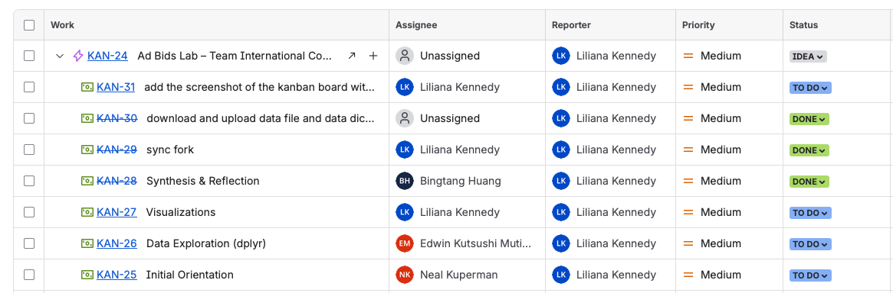

---
editor_options:
  markdown:
    wrap: 72
---

# Tech Lab 1: Team Collaboration Setup

<span style="color:rgba(10, 100, 180, 0.7);">DTR: In general this lab looks really good. I especially liked the metrics that you defined and your thoughtful responses in the "Reflections" section.  I left some comments below (most are after section 6). Since you did not add a screenshot of your Kanban board, I added it so that you'd have a better idea of how to embed images into `.md` or `.Rmd` files, which is pretty useful. Overall, good job! </span>

<span style="color:rgba(500, 100, 25, 1);">**Grade: 97%**</span>

*Use this document as your editable team workspace. Each section may be
filled in collaboratively during the activity or afterward for
submission. Between Sections 1 through 6, each team member must make at
least 4 edits to this document using Git, providing a Commit message
explaining briefly what the edit was and pushing your changes. For
Section 7, each member must provide their own reflections.*

## 1 Client Brief

**Client:** Andrew Sandall (Aditude) is making changes for commit stuff

**Project:** Oregon Ad Bidding Dataset\
**Deliverables:**

-   Identify and document issues in data as well as corrections and
    transformations
-   Provide a Clean dataset
-   Carry out extensive Exploratory Data Analysis (EDA), including
    visualizations & summary insights
-   Share with client reproducible project folder

------------------------------------------------------------------------

## 2 Team Charter

### Roles & Responsibilities (these are just some examples, create roles as you see fit)

| Role | Name | Responsibilities |
|-----------------------|-----------------|--------------------------------|
| Project Manager | Lilly Kennedy | Coordinates work, updates board |
| Data Engineer | Edwin | Manages data imports, cleaning scripts, data manipulation |
| Data Scientist/Communicator | Neal | Conducts EDA, visualization |
| Analyst | Bingtang | Summarizes findings, writes reports |

### Collaboration Policies

Specify your collaboration policies here -- your decision-making process
(e.g., majority vote tech choices, consensus deliverables), WIP
limits/person, Definition of Done (e.g., documented, peer-reviewed,
reproducible), who reviews the work, etc.

- Collaboration policies: 

   - majority vote if discussion fails to resolve issue 
   - consensus deliverables, we all agree on deliverables before they become to dos
   - WIP limits: 2 per person 
   - Definition of done: documented, peer-reviewed, reproducible <span style="color:rgba(10, 100, 180, 0.7);">DTR: Although below you specify how the work is reviewed, is the peer-reviewer the one that decides if the task moves to the "done" status? Or do you socialize reviewed tasks and decide together? </span>

   - Who reviews the work: we will set a peer-reviewer when assigning and agreeing on tasks <span style="color:rgba(10, 100, 180, 0.7);">DTR: This is a great policy, it helps prevent overloading a single person with checking all of the team's work and keeps the team engaged!</span>


### Communication means and cadence

Be explicit about how you plan on communicating

- Currently communicating per text group chat, but will switch to zoom if
we need to collaborate for an extended period of time outside of class
- We will be communicating at least twice a week in class and decide if
we need to communicate more per task by week

### Performance metrics

<span style="color:rgba(10, 100, 180, 0.7);">DTR: These metrics are great!).</span>

Propose 3-5 performance metrics you plan on using to assess if changes
need to be made.

-   **Task Throughput (Tasks Completed per Week)**
    -   Measures team productivity.\
    -   Count the number of tasks moved to "Done" each week.
-   **Average Cycle Time**
    -   Indicates how long tasks take from "In Progress" to "Done".\
    -   Track the average number of days per task in process.
-   **Review Rejection Rate**
    -   Highlights quality or alignment issues.\
    -   Count how many tasks are sent back to "In Progress" after
        review.
-   **Team Engagement (Commits & Contributions per Member)**
    -   Ensures everyone participates consistently.\
    -   Each member should have at least 4 commits; look for even
        contribution spread.
-   **Blocked Time per Task**
    -   Identifies bottlenecks or stalled work.\
    -   Track how long tasks remain blocked or log blockers in stand-up
        logs.

### Completion Rituals

How will you celebrate tasks completed?

-   By taking a moment to acknowledge the work done

-   Shout-out for work well done

------------------------------------------------------------------------

## 3 Board Setup

### Columns

Backlog → To Do → In Progress → Review → Done

### Sample Tasks

*These are just some examples, specify your own -- use some of them if
you'd like*

1.  Import raw bid data from `parquet` file
2.  Check data structure and column consistency
3.  Clean missing bid prices
4.  Remove duplicates based on URL + timestamp
5.  Convert timestamps to Oregon time zone
6.  Summarize bids per advertiser
7.  Visualize bid frequency by hour of day
8.  Explore geographic bidding density
9.  Create a data dictionary
10. Write EDA summary and client memo

------------------------------------------------------------------------

## 4 Daily Stand-Up Simulation Log

### Purpose

A 10-minute synchronization ritual to share progress, identify blockers,
and plan next steps.

| Team Member | Yesterday | Today | Blockers |
|-----------------------|-----------------|----------------|----------------|
| Lilly | Setting up Kanban board and git workflow | writing out git workflow | None |
| Neal | Performing exploratory data analysis | Finalizing exploratory data analysis and making plots | None for now, will need automated workflow to streamline |
| Edwin | Loading, cleaning and data transformation | automating data pipeline | still working, more time needed |
| Bintang | working on standard layout | working on layout | waiting on data |

### Guidelines

-   Keep responses under 1 minute per person.
-   Discuss blockers **after** the stand-up.
-   Update the board live as items move through stages.

------------------------------------------------------------------------

## 5 Retrospective & Recalibration

**Discussion Prompts:**

1.  Which tasks got stuck or delayed? Why?
2.  Did your “Definition of Done” work? If not, what will you change?
3.  Were communication channels effective?
4.  How will you update your workflow next time?

**Action Items:**

-   Adjust WIP limits or column layout.
-   Update team charter accordingly.

------------------------------------------------------------------------

## 6 Submission Checklist

☐ Screenshot of final Kanban board\ 

<span style="color:rgba(10, 100, 180, 0.7);">DTR: There wasn't a Kanban board screenshot included, so I added it so you can see how you include figures in a `.md` file (as well as in a `.Rmd` file).</span>



☐ Finalized Team Charter (with revisions)\

<span style="color:rgba(10, 100, 180, 0.7);">DTR: Good, I your roles table and your policies are good. I especially liked the metrics that you proposed.</span>

☐ Reflection responses (Section 5)\

<span style="color:rgba(10, 100, 180, 0.7);">DTR: See my comments below).</span>


------------------------------------------------------------------------

## 7 Reflection Questions (Individual)

1.  What was your role and what did you learn about team coordination?
2.  How did the Kanban system help (or hinder) your progress?
3.  What’s one improvement you would apply in a real consulting project?

------------------------------------------------------------------------

Lilly's Reflection Response:

1.  My role in this project is project manager. I learned a bit about
    coordinating projects through github it was interesting to learn
    about branching and committing part of coordination since I
    typically work by myself.
2.  The Kanban system helped because it forced me to break down the
    tasks into smaller pieces instead of getting lost in the big
    picture.
3.  In a real consulting project, I would implement clearer task
    ownership by assigning one primary owner per task. This would reduce
    confusion, avoid duplicated work, and improve accountability. While
    collaboration is important, having a single person ultimately
    responsible for driving a task to completion ensures deadlines are
    met and updates are consistent.

<span style="color:rgba(10, 100, 180, 0.7);">DTR: In big projects having a system to keep things organized, with good visibility of where the project stands, and how far along each member is with their tasks, is extremely useful. Keep in mind that the responsibility of the project is shared (and not just the manager's). What the facilitator or manager should do is just help the team stay on track. There are many settings in which there is no hierarchical leadership structure (this is our case, as well as projects where you collaborate with colleagues), and this structure is particularly useful to keep a project moving by providing a mechanism to enforce accountability.</span>

Neal's Reflection Response: 1. My role is Data Scientist/Communicator. I
observed some of the thorny issues that arise when multiple people are
all trying to work on the same doc. Without a proper git workflow,
things can become messy, fast. 2. We have not used the Kanban board long
enough to fully assess its strengths and weaknesses. However, it’s
already proven helpful in visualizing outstanding tasks and coordinating
team efforts. While we’ll likely encounter some hurdles that need
fine-tuning, the value of the Kanban system is evident. 3. Whenever
possible, I would like to ensure that clients are well informed about
the topics they are asking the consultants to address. They don’t need
to be experts, but a solid understanding helps set realistic
expectations and reduces the likelihood of unreasonable requests.


<span style="color:rgba(10, 100, 180, 0.7);">DTR: Agreed, getting started when everyone is trying to learn all of these things at the same time feels chaotic, but exactly what this class is for. Eventually, in the consulting course, the team needs to set expectations about the work, as well as foster and maintain the connection with the client throughout the term. This is one of the things where many teams drop the ball, it's a simple but really important thing.</span>

```         
We need to update git so that pushes to main create a pull request instead of merging automatically
```

<span style="color:rgba(10, 100, 180, 0.7);">DTR: This is a great idea. I will incorporate this as a practice for teams going forward!</span>

Edwin's Reflection Response:

1.  My role was Data Engineer, focusing on data cleaning, handling
    nulls, checking formats, and ensuring data validity. I learned that
    clear communication is key to coordinating updates and maintaining
    data consistency across the team.

2.  The Kanban system helped by breaking down tasks and visualizing
    progress, making collaboration and prioritization much easier.

3.  In a real consulting project, I would add automated data validation
    and quality checks to improve efficiency and reduce manual errors.

<span style="color:rgba(10, 100, 180, 0.7);">DTR: Regarding your last point, I would argue that this would depend on the project, on whether or not this cleaning process is something that you'll need to run repeatedly with data updates or just once. I say this because the data cleaning process is so problem dependent, that building automated checks might prove to be a moot exercise that would take time away from making progress in other more pressing fronts. Especially because typically consulting projects progress under really tight deadlines.</span>


Bingtang's Reflection Response:

1.  My role was Analyst, focusing on summarizing findings, and writing
    reports.I learned that team coordination is the critical link
    between raw data and client recommendations. I must proactively
    check in with them to understand the context behind their data, not
    just wait for a final file.

2.  The Kanban system helps me visualize the workflow, and identifies
    Blockers clearly, so I could move my task card to a blocked column
    and tag the responsible person.

3.  In a real consulting project, I would like to ask another analyst or
    consultant to review my work before I send it to the Project
    Manager. A fresh perspective from others helps me spot logical
    flaws, formatting errors, and overlooked confusing passages.

<span style="color:rgba(10, 100, 180, 0.7);">DTR: Totally agree, it is essential to have steady contact with the client throughout the project to make better decisions regarding the data. Also, having your peers' eyes on your work helps catch things that you missed or that could be improved.  </span>
