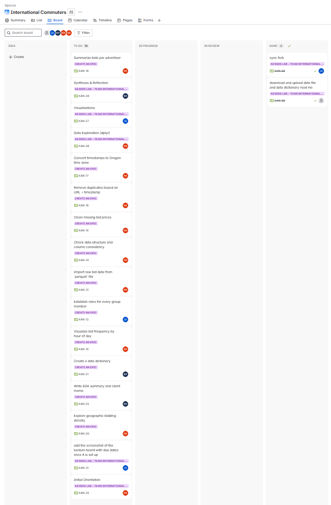

```{r setup, include=FALSE}
knitr::opts_chunk$set(
  echo = TRUE,
  message = FALSE,
  warning = FALSE
)
```

# Overview

In this lab, your team will explore the online advertising auctions
data. Your goals are to:

-   Practice **data manipulation** in R (using tidyverse).
-   Practice **data visualization** using concepts from the Data
    Visualization session.
-   Identify **3–4 data quality issues** that would matter in a real
    analysis workflow.
-   Communicate results clearly and professionally as a team.

This lab is designed to take **2–3 hours** of focused collaborative
work.

> Today, you are only exploring, visualizing, interpreting, and
> identifying suspicious looking issues.

------------------------------------------------------------------------

# Git Workflow, Collab, and Use of Generative AI

This is a **team-based exploratory analysis**.

## Git Workflow

-   **One team member** should fork the course lab repository.
-   In the team’s cloned fork, create the `data/` folder:
-   That person should **add the rest of the team as collaborators**.
-   All team members should clone the **same shared fork** (creating an
    RStudio project).

To keep collaboration smooth:

-   Pull before you start working.
-   Commit frequently, with clear messages (e.g., "added price
    histogram", "investigated region codes").
-   Remember to pull before pushing.
-   Push your work regularly.

I will review the **Git commit history** to understand who contributed
what. Individual grades depend on **meaningful contribution** from each
student.

## Team Planning (Required)

Before you begin, read the entire lab together (5–10 minutes).

-   Make sure everyone understands the goals, deliverables, and
    sections.

Decide how to divide the work (3–4 members).

-   As a team, choose a coordinator for each major section, and within
    sections split the work

    -   Section 1: Initial Orientation - Neal
    -   Section 2: Data Exploration (dplyr) - Edwin
    -   Section 3: Visualizations - Lilly
    -   Section 4: Synthesis & Reflection - Bingtang

-   Section coordinators will ensure their sections are completed
    throughout the lab's development

Create a Jira Kanban Board (team facilitator).

-   Go to Jira → Create Project → Kanban template

-   Create a board titled: “Ad Bids Lab – Team <YourTeamName>”

-   Add cards for each task/subtask, including:

    -   Task name
    -   Description
    -   Assigned team member
    -   Due date (based on team timeline)

Upload a screenshot (I'll check the time and date of the file) of the
Kanban board.

-   A screenshot showing all initial cards in the To Do column and
    assignments.

-   Save it in your repository under: `planning/kanban_screenshot.png`

-   Add it **here**.



Make use of the team charter that you designed in Lab01, using the
Kanban board throughout the project to keep you on task, correcting
issues that arise and readjusting as needed.

## Use of Generative AI

You **may** use Gen.AI tools **as support**, not as a replacement.

Appropriate AI uses:

-   Understanding R errors
-   Asking for explanations of functions & syntax
-   Debugging when stuck
-   Checking whether your code is reasonable

Inappropriate uses:

-   Asking AI to complete most or all of the lab
-   Copying AI-generated code you don’t understand
-   Using AI to write your interpretations or summaries

Your code and reasoning must reflect **your own team’s understanding**.

------------------------------------------------------------------------

# Data and Setup

1.  Each team member should download from Canvas two files in
    `Modules → ProjectInformation`:

-   `bids_data_vDTR.parquet`

-   A **data dictionary** describing each variable

3.  In your local repo add the data and data dictionary to the `data`
    folder

4.  Add the data and dictionary file to your .gitignore

5.  Verify that Git is ignoring the files (in the RStudio terminal write
    `git status` these files should not be listed in the output)

6.  Load `tidyverse`, `ggplot2` and any other packages you find useful
    (`arrow`, `lubridate`, etc.)

```{r load-data, echo=FALSE}
#Load relevant libraries - update as needed if there are functions you need that are not in existing libraries
library(tidyverse)
library(arrow)
library(glue)
library(knitr)
library(dplyr)
library(here)
library(kableExtra)
library(jsonlite)
library(knitr)
```

```{r, echo=FALSE}

#Load and view data - every person make sure you have the data uploaded yourself and added to git ignore

original_bids <- read_parquet(here("data", "bids_data_vDTR.parquet"))
bids <- original_bids %>% mutate(row_id = row_number())
glimpse(bids)

```

------------------------------------------------------------------------

# 1. Initial Orientation (10–15 minutes)

Answer the following in complete sentences. Use code chunks to support
your answers, but write the answers in prose.

1.  How many rows and columns are in the dataset?
2.  According to the data dictionary, what does each row represent?
3.  Which variable(s) are the `key(s)` (i.e., the row identifiers)
4.  Which variables appear:
    -   numerical?
    -   categorical?
    -   suspicious or inconsistent with the dictionary?
5.  Name **two variables** you expect to matter most to advertisers and
    explain why.

## *(Write your answers below.)*

Neal: I went ahead and started doing more data cleaning than what was
asked for within these questions. Below are concise answers to the
questions, followed by the data cleaning code as is. The cleaning code
will be moved to a script that can be called from the markdown file.

Additionally, I removed some rows and know I did not catch all of the
"errors" added to the data. In the future, I can not remove rows and
instead just mark them as an issue to be discussed.

**1. How many rows and columns are in the dataset? called so not to
crowd the markdown file.**

```{r number of rows, echo=FALSE}
print(glue("The Bids dataframe has {nrow(bids)} rows"))
```

<br> <br> **2. According to the data dictionary, what does each row
represent?**

```{r read data_dictionary.md, echo=FALSE, results='asis'}

# Read the file
lines <- readLines(here("data", "data_dictionary.md"))

# Find start and end line numbers
start_line <- which(grepl("^\\| Column \\|", lines))[1]
end_line <- which(grepl("\\| `BID_WON` \\|", lines))[1]

# Extract the table
table_lines <- lines[start_line:end_line]
cat("\n\n")
cat(table_lines, sep = "\n")
cat("\n\n")


```

**3. Which variable(s) are the `key(s)` (i.e., the row identifiers)**

There is no key currently available given the data provided. There are
duplicate rows and even when duplicated rows are removed, you can not be
guaranteed to uniquely identify a specific bid by any subsets of the
rows. For example, see the following:

```{r}
ex <- bids %>% group_by(AUCTION_ID, PUBLISHER_ID) %>%  filter(n() > 1) %>% head(5)
print(ex)
```

The only difference between the 1st and 4th rows is the 3rd decimal
place on the price. Those two rows may be the same and one just had more
precision on the price, but without asking the client, we do not know. I
added a row_id so we can at least have a known unique identifier. I
would have to ask the client how they identify a specific bid

**5. Which variables appear:** - numerical? - categorical? - suspicious
or inconsistent with the dictionary?

See the table, *Summary of column types*, below for summary of type
mismatches

**6.Name two variables you expect to matter most to advertisers and
explain why**

I would expect the two most important variables are price and if they
won the bid. They want to have their advertisements see as frequently as
possible at the lowest possible price

```{r Data Cleaning Functions, echo=FALSE}
col_diff <- function(df, expected_columns) {
  setdiff(expected_columns$column, colnames(df))
}

col_common <- function(df, expected_columns) {
  intersect(colnames(df), expected_columns$column)
}

col_type_check <- function(bid_df, expected_columns) {
  common_columns <- col_common(bid_df, expected_columns)

  bid_col_types <- sapply(bid_df, function(x) class(x)[1])

  # Need to do this to ensure order of rows is correct
  expected_types <- tibble(column = common_columns) %>%
    left_join(expected_columns, by = "column") %>%
    pull("Expected_Type") %>%
    unname()

  col_type_comp <- expected_types == bid_col_types[common_columns]

  comparison <- tibble(column = common_columns) %>%
    mutate(actual = bid_col_types[common_columns]) %>%
    left_join(expected_columns, by = "column") %>%
    mutate(match = col_type_comp, .before = "Notes_Actual_Type")

  comparison
}

missing_bids_df <- function(df) {
  df[!complete.cases(df), ]
}

complete_bids_df <- function(df) {
  df[complete.cases(df), ]
}
```

<br>

#### <u>Removing rows with missing values</u> {.unnumbered}

<center>**Removing rows with missing values**</center>

```{r Removing rows with missing values, echo=FALSE}
bids %>%
  group_by(AUCTION_ID, PUBLISHER_ID) %>%
  filter(n() > 1) %>%
  arrange(AUCTION_ID, PUBLISHER_ID)
# identify rows with missing values

missing_bids <- missing_bids_df(bids)
complete_bids <- complete_bids_df(bids)

cols_w_na <- data.frame(
  `na count` = colSums(is.na(bids))[colSums(is.na(bids)) > 0]
)

col_blank_count <- bids %>%
  # Step 1: Count blanks in each column
  summarise(across(everything(), ~ sum(. == "", na.rm = TRUE))) %>%
  # Step 2: Convert from wide to long format (easier to work with)
  pivot_longer(everything(), names_to = "column", values_to = "blank count")

# Step 3: Keep only columns that have blanks
col_w_blank <- col_blank_count %>% filter(`blank count` > 0)


cat("there are", nrow(missing_bids), "rows with missing values")
cat("there are", nrow(complete_bids),
  "rows with no missing values remaining in the dataset")

kable(cols_w_na)

# overwrite bids to include only complete rows
bids <- complete_bids_df(bids)
```

<center>**Removing duplicate rows**</center>

```{r Removing duplicate rows, echo=FALSE}

# identify duplicate rows
bids_duplicate <- bids[duplicated(bids[, !(names(bids) %in% "row_id")]), ]
bids_unique <- bids[!duplicated(bids[, !(names(bids) %in% "row_id")]), ]

cat("there are", nrow(bids_duplicate), "duplicate rows in the dataset")
cat("there are", nrow(bids_unique), "unique rows remaining in the dataset")

# overwrite bids to include only unique rows
bids <- bids_unique


```

#### <u>Dataset Type Checking</u> {.unnumbered}

Checking column types of the data and comparing to the types provided in
data_dictionary.md:

```{r Data Cleaning, echo=FALSE}

expected_data_columns <- data.frame(
  column = c(
    "TIMESTAMP", "DATE_UTC", "AUCTION_ID", "PUBLISHER_ID",
    "DEVICE_TYPE", "DEVICE_GEO_COUNTRY", "DEVICE_GEO_REGION",
    "DEVICE_GEO_CITY", "DEVICE_GEO_ZIP", "DEVICE_GEO_LAT",
    "DEVICE_GEO_LONG", "REQUESTED_SIZES", "SIZE", "PRICE",
    "RESPONSE_TIME", "BID_WON"
  ),
  Expected_Type = c(
    "POSIXct", "Date", "character", "character", "character",
    "character", "character", "character", "character", "numeric",
    "numeric", "list", "character", "numeric", "integer", "logical"
  ),
  Notes_Actual_Type = c(
    "TIMESTAMP_NTZ", "DATE", "VARCHAR", "VARCHAR", "VARCHAR",
    "VARCHAR(2)", "VARCHAR(2)", "VARCHAR", "VARCHAR(10)", "FLOAT",
    "FLOAT", "VARCHAR (or ARRAY)", "VARCHAR", "NUMBER(12,6)",
    "NUMBER(10,0)", "BOOLEAN"
  ),
  stringsAsFactors = FALSE
)

missing_columns <- col_diff(bids, expected_data_columns)
comparison <- col_type_check(bids, expected_data_columns)

```

<br>

<center>**Missing columns:**</center>

`r paste0(seq_along(missing_columns), ". ", missing_columns, collapse = "<br>")`
<br> <br>

<center>**Summary of column types**</center>

```{r, echo=FALSE}
comparison %>%
  kable("html", escape = FALSE, align = c("l", rep("c", ncol(comparison) - 1))) %>%
  row_spec(which(!comparison$match), background = "#62ec0001") %>%
  column_spec(seq_len(ncol(comparison)), extra_css = "padding-right: 30px; padding-left: 20px;") %>% # nolint
  kable_styling(full_width = FALSE)

cat("Converting columns to the expected types")
cat("\n")

# Convert TIMESTAMP from character to TIMESTAMP_NTZ (POSIXct)
bids$TIMESTAMP <- as.POSIXct(bids$TIMESTAMP, format = "%Y-%m-%d %H:%M:%S", tz = "UTC")

# Convert DATE_UTC from character to Date (YYYY-MM-DD)
bids$DATE_UTC <- as.Date(bids$DATE_UTC, format = "%Y-%m-%d")

# Convert DEVICE_TYPE from integer to character
bids$DEVICE_TYPE <- as.character(bids$DEVICE_TYPE)

# convert PRICE from character to numeric
bids$PRICE <- as.numeric(bids$PRICE)

# convert REQUESTED_SIZES from character to list
bids$REQUESTED_SIZES <- lapply(bids$REQUESTED_SIZES, fromJSON)

# get all unique sized in requested sizes
sizes <- unique(unlist(bids$REQUESTED_SIZES))
glue("there are , {length(sizes)}, unique REQUESTED_SIZES")

# convert RESPONSE_TIME from character to Integer
  # gsub() = global substitution.
  # It finds all matches of pattern in x and replaces them with replacement.
  # [0-9] means “a digit from 0 to 9”
  # ^ inside brackets means NOT
  # [^0-9]  means: "anything that is NOT a digit"
  # "" means: "replace with nothing"
bids$RESPONSE_TIME <- gsub("[^0-9]", "", bids$RESPONSE_TIME)
bids$RESPONSE_TIME <- as.integer(bids$RESPONSE_TIME)

# convert BID_WON from character to Logical
bids$BID_WON <- as.logical(bids$BID_WON)


comparison <- col_type_check(bids, expected_data_columns)
if (any(!comparison$match)) {
  cat("There are columns that do not match the expected types")
} else {
  cat("All columns match the expected types")
}
```

------------------------------------------------------------------------

# 2. Data Exploration Using `dplyr` (30–40 minutes)

Use functions you are comfortable with from `dplyr` and `tidyr`. Tables
and summaries should be created in code chunks; explanations should be
written as text.

## 2.1 Geographic Exploration

Explore the geographical fields (such as `DEVICE_GEO_COUNTRY`,
`DEVICE_GEO_REGION`, `DEVICE_GEO_CITY`, `DEVICE_GEO_ZIP`).

Tasks:

1.  Create tables with the **top 3 regions** and the **top 10 cities**
    by count of rows.

```{r}
# top 3 regions by zip code

top_regions <- bids %>%
  count(DEVICE_GEO_REGION, sort = TRUE) %>%
  slice_head(n = 3)

# print table
kable(top_regions, caption = "Top 3 Regions by Count")

# top 10 cities
top_cities <- bids %>%
  count(DEVICE_GEO_CITY, sort = TRUE) %>%
  slice_head(n = 10)


# print table
kable(top_cities, caption = "Top 10 Cities by Count")

```

2.  Compare the region codes to what the data dictionary says they
    should look like.

```{r}
# check for region validity
region_format_check <- bids %>%
  mutate(is_valid_region = grepl("^[A-Z]{2}$", DEVICE_GEO_REGION)) %>%
  count(is_valid_region)

# table
kable(region_format_check, caption = "Region validity")

```

3.  Identify **at least one** region code that is clearly suspicious,
    and explain why.

```{r}
# check format of region
suspicious_regions <- bids %>%
  filter(!grepl("^[A-Z]{2}$", DEVICE_GEO_REGION)) %>%
  count(DEVICE_GEO_REGION, sort = TRUE)

# table
kable(suspicious_regions, caption = "Suspicious regions")

```

```{r geo-explore}
# TODO: your code for geographic exploration
```

*(Write your interpretation below.)*

Most of the region codes in the dataset look correct, but about a
quarter of all rows (104,325) do not follow the expected two-letter
state format. This suggests there may be misclassified or inconsistently
recorded entries. Many of the top ten cities also appear to be large
cities in Oregon, which aligns with the pattern seen in the region
field. Suspicious region codes such as “Or,” “oregon,” and “xor” show up
in the data; these are not valid two-letter U.S. state codes under the
Prebid Data Dictionary and likely represent inconsistent ways of
referring to Oregon.

------------------------------------------------------------------------

## 2.2 Price Behavior

Study the `PRICE` variable.

Tasks:

1.  Produce numerical summaries of `PRICE` (e.g., min, max, median,
    selected quantiles).

```{r}
# price summary

price_summary <- bids %>%
  summarise(
    min      = min(PRICE, na.rm = TRUE),
    q1       = quantile(PRICE, 0.25, na.rm = TRUE),
    median   = median(PRICE, na.rm = TRUE),
    mean     = mean(PRICE, na.rm = TRUE),
    q3       = quantile(PRICE, 0.75, na.rm = TRUE),
    p95      = quantile(PRICE, 0.95, na.rm = TRUE),
    max      = max(PRICE, na.rm = TRUE)
  )

# table
kable(price_summary, caption = "Price summary")

```

2.  Identify implausible price ranges or values and explain why they are
    implausible.

<!-- # NOTE: We may want to change the max price that is considered implausible. Probably based on the std of the price data? 500 seems high when the mean is 0.45? Even though the data dict says 500 is the high? -->
```{r}
# checking implausible price range by data dictionary direction

implausible_prices <- bids %>%
  filter(PRICE < 0 | PRICE >= 500)

# Count implausible price values
implausible_count <- implausible_prices %>% count()
cat("Total number of out-of-bound PRICE values =", implausible_count$n, "\n")


```

3.  Investigate whether suspicious prices seem to cluster by **one** of
    the following:
    -   publisher,
    -   region, **or**
    -   ZIP code.

Choose only one dimension and describe what you find.

```{r}
# suspicious prices by region

suspicious_by_region <- implausible_prices %>%
  count(DEVICE_GEO_REGION, sort = TRUE)

# table
kable(suspicious_by_region, caption = "Price Outlier by Region")
```

```{r price-explore}
# TODO: your code for exploring PRICE
```

*(Write your interpretation below.)*

The price distribution ranges from –999 to 115.13, with a median of 0.20
and most values concentrated toward the lower end. While many prices
appear reasonable, the presence of negative values and unusually high
spikes indicates some data quality issues. Using the data dictionary
rule that prices must fall between 0 and 500, there are 105 values that
fall outside this range.

When checking distribution of this anomaly recorded under several
different names. The most common entries are “OR” (76), followed by “Or”
(16), “oregon” (9), and “xor” (4).

------------------------------------------------------------------------

## 2.3 Response Time Behavior

Investigate the `RESPONSE_TIME` variable.

Tasks:

1.  Examine its data type and typical values.

```{r}
# check response time class
response_overview <- bids %>%
  summarise(
    data_type = class(RESPONSE_TIME),
    example_values = paste(unique(RESPONSE_TIME)[1:5], collapse = ", ")
  )

# table
kable(response_overview, caption = "Response overview")
```

2.  Look for common patterns or prefixes/suffixes in the values.

```{r}
# group by time patterns
response_patterns <- bids %>%
  mutate(pattern = substr(RESPONSE_TIME, 1, 5)) %>%
  count(pattern, sort = TRUE) %>%
  slice_head(n = 5)

# table
kable(response_patterns, caption = "Response patterns")

```

3.  Identify an issue that would prevent straightforward numerical
    analysis.

```{r}
# check how many can be converted to numeric
response_check <- bids %>%
  mutate(
    numeric_attempt = suppressWarnings(as.numeric(RESPONSE_TIME)),
    is_numeric = !is.na(numeric_attempt)
  ) %>%
  count(is_numeric)

# table
kable(response_check, caption = "Response check")
```

```{r rt-explore}
# TODO: your code for exploring RESPONSE_TIME
```

*(Write your interpretation below.)*

Before cleaning, the RESPONSE_TIME field was stored as text, even though
the values looked like numbers—for example, entries appeared in formats
such as “RESPONSE TIME: 234”. Because of this extra wording, the values
could not be treated as numeric, which made it difficult to summarize or
analyze response times in a meaningful way.

After cleaning, the extra text was removed and the remaining values were
converted into proper numbers. Once in numerical form, the response
times showed a clean and consistent distribution with no unusual values
or anomalies. This confirms that the original issue was purely
formatting-related rather than a problem with the underlying data
itself.

------------------------------------------------------------------------

# 3. Visualization Challenges (45–60 minutes)

Create **three** high-quality visualizations using `ggplot2`.

Each figure must include:

-   A clear and professional title
-   Labeled axes
-   A readable theme (e.g., `theme_bw()`, `theme_minimal()`)
-   Thoughtful design choices (color, faceting, ordering, etc.)
-   A **3–5 sentence interpretation**

## 3.1 Plot 1 — Distribution of Bid Prices

Create a visualization that reveals:

-   The overall shape of the price distribution
-   Outliers or impossible values
-   Any issues you suspect based on the data dictionary

```{r plot-price}
# TODO: your price distribution plot

library(ggplot2)
library(dplyr)

normal_bids <- bids %>%
  filter(!is.na(PRICE), PRICE >= 0, PRICE <= 5)

ggplot(normal_bids, aes(x = PRICE)) +
  geom_histogram(binwidth = 0.1, fill = "steelblue", color = "white") +
  labs(
    title = "Distribution of Normal Bid Prices (0–5 USD)",
    x = "Price (USD)",
    y = "Frequency"
  ) +
  theme_minimal()


```

*Interpretation (3–5 sentences):* This histogram visualizes the
distribution of valid bid prices ranging from 0 to 5 USD. The majority
of bids are concentrated below \$1, with a noticeable peak around
\$0.20, indicating a strong skew toward lower prices. We chose to
exclude outliers (e.g., prices above \$5) and invalid entries (e.g.,
negative values like –999) because they are rare and would distort the
scale of the plot, making it harder to interpret the meaningful patterns
in the bulk of the data. By filtering to a reasonable range, we can
clearly observe the common pricing behavior used in the majority of
auctions. This cleaned view provides more accurate insights for
understanding typical bidding trends.

------------------------------------------------------------------------

## 3.2 Plot 2 — Price by Zip City

Compare a central price measure (mean or median) across cities

Guidance:

-   Be explicit about whether you use mean or median.
-   Consider sorting cities by the measure you plot.
-   Highlight any cities whose price behavior appears inconsistent or
    suspicious.

```{r plot-price-region}
# TODO: your price-by-region plot

city_medians <- bids %>%
  filter(!is.na(PRICE), PRICE >= 0) %>%
  group_by(DEVICE_GEO_CITY) %>%
  summarise(
    n = n(),
    median_price = median(PRICE)
  ) %>%
  arrange(desc(median_price)) %>%
  slice_head(n = 15)

ggplot(city_medians, aes(x = reorder(DEVICE_GEO_CITY, median_price), y = median_price)) +
  geom_col(fill = "blue") +
  coord_flip() +
  labs(
    title = "Top 15 Cities by Median Bid Price",
    x = "City",
    y = "Median Price (USD)"
  ) +
  theme_bw()


```

*Interpretation (3–5 sentences):*

This bar chart displays the median bid price across the top 15 cities
with the highest individual median prices since looking at all of the
cities was far too overwhelming. We chose to use the median rather than
the mean to reduce the influence of outliers and provide a more accurate
representation of typical bid values in each city. The cities are sorted
by descending median price, making it easier to spot unusually high
values. Several cities near the top, such as White City, Drewsey, and
Columbia City, show unexpectedly high median prices; but also have very
low bid counts (1 or 4 bids), which may not provide reliable estimates.
These small sample sizes suggest potential data quality issues or
artifacts, and such entries should be treated cautiously in any modeling
or reporting efforts.

------------------------------------------------------------------------

## 3.3 Plot 3 — Analyst’s Choice

Choose a visualization that you believe would be useful to a data
science team at an advertising company.

Possible ideas:

-   Auction volume by hour of day
-   Differences between winning and losing bids
-   ZIP code irregularities
-   Response time patterns
-   Publisher-level differences

Your plot should answer a clear question, and your interpretation should
explain what you learned.

```{r plot-analyst-choice}
# TODO: your analyst's choice plot

bids %>%
  filter(!is.na(PRICE), !is.na(BID_WON)) %>%
  mutate(BID_WON = ifelse(BID_WON, "Won", "Lost")) %>%
  ggplot(aes(x = BID_WON, y = PRICE, fill = BID_WON)) +
  geom_boxplot(outlier.shape = NA, width = 0.5) +
  coord_cartesian(ylim = c(0, 5)) +
  labs(
    title = "Bid Price Comparison: Won vs Lost Bids",
    x = "Bid Outcome",
    y = "Bid Price (USD)"
  ) +
  theme_minimal() +
  theme(legend.position = "none")

```

*Interpretation (3–5 sentences):*

This boxplot is looking at the distribution of bid prices between bids
that won and lost, using only the values within the most common 0-5 USD
range. We chose a boxplot because it clearly shows medians, variability,
and differences between groups; making it easy to compare central
tendencies and spread. The plot reveals that winning bids tend to be
slightly higher in price, with fewer extremely low values compared to
losing bids. This analysis is especially useful for a data science team
in advertising, as it can inform optimal pricing strategies and help
identify the minimum price threshold needed to remain competitive.
Understanding these bid patterns enables teams to increase win rates
while avoiding overspending.

------------------------------------------------------------------------

# 4. Synthesis & Reporting (20–25 minutes)

## 4.1 Data Quality Issues

Based on your work above, list **3–4** data quality issues you
discovered. For each issue:

-   Name the affected variable(s).
-   Describe what the issue is.
-   Provide evidence (e.g., from a summary, table, or plot).
-   Suggest one way you would address it in a later **data cleaning**
    lab.

**1. Invalid or Inconsistent Region Codes** *Affected Variable:
DEVICE_SEQ_REGION* *Issue: Many entries do not follow the standard
two-letter U.S. state postal codes (e.g., “Or,” “oregon,” “xor”).*
*Evidence: Checking how many different text values in the
DEVICE_GEO_REGION variable.*

```{r}
unique_regions <- unique(original_bids$DEVICE_GEO_REGION)
unique_regions
```

*Cleaning Suggestion: Standardize region values by mapping common
misspellings and variations to valid USPS codes (e.g., “oregon” → “OR”,
“Or” → “OR”). Invalid or unmappable entries could be set to NULL or
flagged.*

**2. Price Values Outside Valid Range** *Affected Variable: PRICE*
*Issue: Some prices are out of the range between 0 and 500.* *Evidence:
Checking the minimum and maximum of price*

```{r}
price_min_max <- bids %>%
  summarise(
    min      = min(PRICE, na.rm = TRUE),
    max      = max(PRICE, na.rm = TRUE)
  )

# table
kable(price_min_max, caption = "Min and Max Price")
```

*Cleaning Suggestion: Filter out or cap values outside the [0, 500]
range, or treat them as NULL if they are not usable for analysis.*

**3. Incorrect Data Type for Response Time** *Affected Variable:
RESPONSE_TIME* *Issue: The field was stored as text with extraneous
wording (e.g., “RESPONSE TIME: 234”), preventing numerical analysis.*
*Evidence:Checking data type of RESPONSE_TIME*

```{r}
head(original_bids$RESPONSE_TIME, 10)
class(original_bids$RESPONSE_TIME)
```

*Cleaning Suggestion: Use string parsing (e.g., REGEXP_SUBSTR) to
extract numeric values and convert the column to a numeric type (e.g.,
NUMBER).*

------------------------------------------------------------------------

## 4.2 Implications for Analytics

In 1–2 paragraphs, discuss how the issues you identified could affect:

-   Business decisions,
-   Reporting to advertisers, and/or
-   Predictive modeling.

Which issues are most critical to fix before building models, and why?

*Inconsistent region codes can distort geographic performance analysis,
potentially leading to misallocation of advertising budgets or reporting
incorrect geographic insights to advertisers. Exceeding the price range
may distort the average CPM calculation, leading to inaccurate revenue
forecasts or misleading pricing recommendations. Advertisers might then
adjust their strategies in the wrong direction.*

*The most critical to fix before building predictive models are the
invalid price values and incorrect data types for response time. The
abnormal price (e.g. negative or extreme value) will seriously interfere
with the prediction of the model for the success probability of bidding
or the optimal pricing strategy, while the non-numeric response time
will be completely unusable for the key performance indicator.*

------------------------------------------------------------------------

## 4.3 Reflection: Tools, Workflow, AI Use

Write 5–8 sentences reflecting on:

-   Which R tools or approaches were most useful in this lab.
-   What worked well in your Git/gitHub workflow and team collaboration.
-   One thing you would change next time to improve your process.
-   Whether and how you used generative AI (if at all), and how it
    affected your understanding.

*The dplyr and tidyr packages were most useful in this lab, for data
cleaning and transformation.*

*Our Git/GitHub workflow worked well with a clear branching strategy,
where each member worked on feature branches for specific sections
before merging into main. This prevented conflicts and maintained code
stability. Regular commits with descriptive messages made it easy to
track progress and revert changes if needed.*

*One thing we would change next time would be to implement a more
systematic data validation framework for the analysis process, to check
the data quality.*

*We use generative AI to determine what code meets our requirements and
how to fix errors when the code occurs.*
